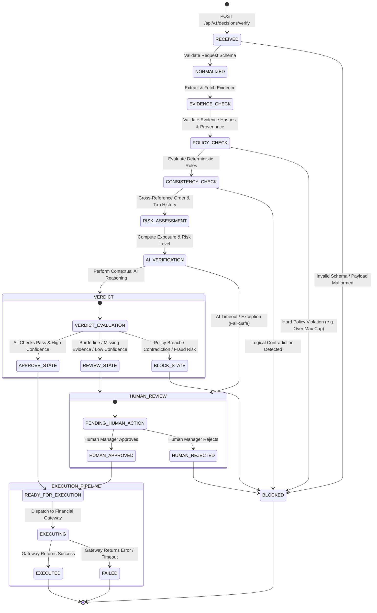

# TrustLedger — Decision Lifecycle & State Machine

**Version:** 0.1.0 (Phase 0 Foundation)  
**Document Status:** Core Lifecycle Specification  

---

## 1. Overview

The decision lifecycle defines the exact deterministic state progression of every financial decision request submitted to TrustLedger. A decision request transitions through linear verification stages before reaching a binding verdict state, followed by controlled downstream handling.

---

## 2. Mermaid State Diagram



---

## 3. State Machine Definitions & Transition Rules

### 1. `RECEIVED`
- **Trigger**: AI Agent issues `POST /api/v1/decisions/verify`.
- **Precondition**: HTTP request received at gateway.
- **Action**: Validates API authentication token, checks idempotency key.
- **Next State**: `NORMALIZED` if payload structurally valid; `BLOCKED` if malformed.

### 2. `NORMALIZED`
- **Trigger**: Successful initial schema validation.
- **Action**: Transforms incoming request into canonical `DecisionRequest` model. Assigns tracking `decision_id`, normalizes currency to standard units, standardizes ISO timestamps.
- **Next State**: `EVIDENCE_CHECK`.

### 3. `EVIDENCE_CHECK`
- **Trigger**: Payload normalized.
- **Action**: Fetches referenced evidence artifacts (`evidence_references`). Computes `SHA-256` content hashes and compares against evidence storage registry. Evaluates evidence freshness and source credibility.
- **Next State**: `POLICY_CHECK`.

### 4. `POLICY_CHECK`
- **Trigger**: Evidence artifacts evaluated.
- **Action**: Runs deterministic business rules against `merchant_id` policy set. Checks amount caps, transaction frequency limits, restricted actions, and time windows.
- **Next State**: `CONSISTENCY_CHECK` if no hard policy violation; `BLOCKED` if hard violation occurs.

### 5. `CONSISTENCY_CHECK`
- **Trigger**: Deterministic policy evaluation completed.
- **Action**: Cross-checks decision fields against historical databases. Verifies requested refund amount does not exceed original payment amount, checks order status (e.g. not already refunded), and validates customer identity alignment.
- **Next State**: `RISK_ASSESSMENT` if consistent; `BLOCKED` if contradiction detected.

### 6. `RISK_ASSESSMENT`
- **Trigger**: Decision passes consistency checks.
- **Action**: Calculates financial risk score, customer lifetime value ratio, velocity indicators, and transaction exposure metrics.
- **Next State**: `AI_VERIFICATION`.

### 7. `AI_VERIFICATION`
- **Trigger**: Risk assessment score calculated.
- **Action**: Prepares structured `VerificationPacket` containing decision context, policy results, evidence content, and risk scores. Invokes Python FastAPI AI Verifier service for contextual reasoning.
- **Next State**: `VERDICT` upon receiving structured output; `HUMAN_REVIEW` on timeout or exception (Fail-Safe).

### 8. `VERDICT`
- **Trigger**: Aggregation of deterministic check results, risk scores, and AI verification output.
- **Action**: Decision Gate applies final binding logic:
  - **`APPROVE`** → State transitions to `READY_FOR_EXECUTION`.
  - **`REVIEW`** → State transitions to `HUMAN_REVIEW`.
  - **`BLOCK`** → State transitions to `BLOCKED`.

---

## 4. Downstream Execution States (Documented Blueprint for Phase 1+)

*Note: Execution implementation is deferred to subsequent phases. Phase 0 defines the contractual state transition requirements.*

### Automated Execution Lifecycle (`APPROVE` Path)
- **`READY_FOR_EXECUTION`**: Action authorized. Queued for financial dispatch.
- **`EXECUTING`**: Payload dispatched to simulated/live payment gateway adapter (e.g., Razorpay / Stripe mock).
- **`EXECUTED`**: Gateway returns success acknowledgment (`provider_reference` recorded). Lifecycle complete.
- **`FAILED`**: Gateway execution fails (network error, insufficient funds). Flagged for retry or operator notification.

### Human Escalation Lifecycle (`REVIEW` Path)
- **`HUMAN_REVIEW`**: Action placed in merchant admin review queue.
- **`HUMAN_APPROVED`**: Human manager inspects evidence and manually authorizes action. Moves to `READY_FOR_EXECUTION`.
- **`HUMAN_REJECTED`**: Human manager rejects action. Moves to `BLOCKED`.

---

## 5. State Transition Matrix & Audit Logging

Every single state transition triggers an immutable `AuditRecord` event:

```typescript
{
  "event_id": "evt_10928374",
  "decision_id": "dec_8f7b2a9c-1234-4567-89ab-cdef01234567",
  "event_type": "STATE_TRANSITION",
  "actor": "TrustLedger_PolicyEngine",
  "timestamp": "2026-08-29T19:30:00.104Z",
  "previous_state": "EVIDENCE_CHECK",
  "new_state": "POLICY_CHECK",
  "reason": "Evidence hashes verified. Proceeding to merchant policy rule evaluation.",
  "metadata": {
    "evidence_count": 2,
    "valid_hashes": 2
  }
}
```
